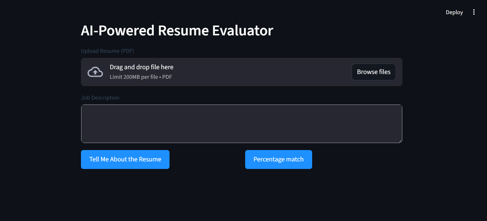

# AI-Powered Resume Evaluator

This project is an AI-powered Resume Evaluator that analyzes how well a resume aligns with a given job description. Leveraging natural language processing (NLP), semantic embeddings, and dynamic keyword extraction, it simulates the behavior of modern ATS platforms to deliver a comprehensive match score. The system helps both job seekers and recruiters assess fit with precision, beyond simple keyword matching.

---

## 🚀 Features

📄 Resume Upload & Parsing using Streamlit file uploader
🖼️ PDF-to-Image Conversion for Gemini's multimodal input
🤖 Gemini 1.5 Flash Integration for AI-powered resume evaluation
📝 Custom Prompting to drive HR-style or ATS-style assessments
📊 ATS-Style Match Scoring with percentage and summary output
⚡ Real-Time Feedback delivered through a responsive Streamlit UI

---

## 📦 Tech Stack

- Python 3.10+ — Core programming language
- Streamlit — Interactive web interface
- PyMuPDF (fitz) — PDF parsing and text extraction
- pdf2image — Convert PDF to image format for Gemini input
- Google Generative AI SDK — Integrates Gemini 1.5 Flash for LLM-based resume evaluation
- dotenv — Manages API keys securely via .env files
- PIL (Pillow) — Image manipulation and processing

---

## 📁 Project Structure

```
/project-root/
│
├── .env
├── app.py
├── requirements.txt
└── README.md
```

---

## 📸 Screenshots



---

## Author

👤 **[Vetrivel Maheswaran](https://github.com/Vetrivel07)**

## Connect With Me 🌐

**[](https://www.linkedin.com/in/vetrivel-maheswaran/)**

**[](https://vetrivel07.github.io/vetrivel-maheswaran)**

<p align="center"><b>© Created by Vetrivel Maheswaran</b></p?
